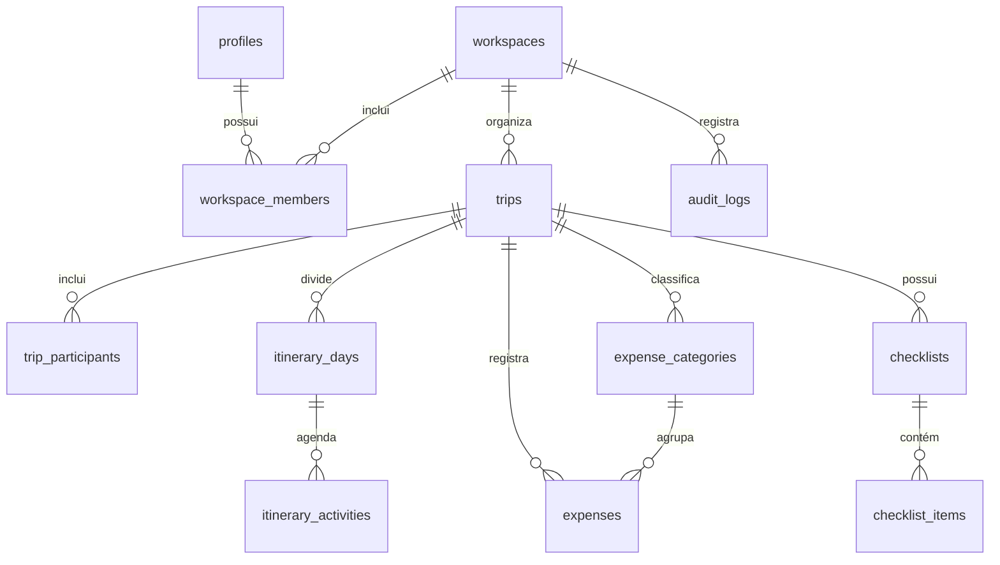
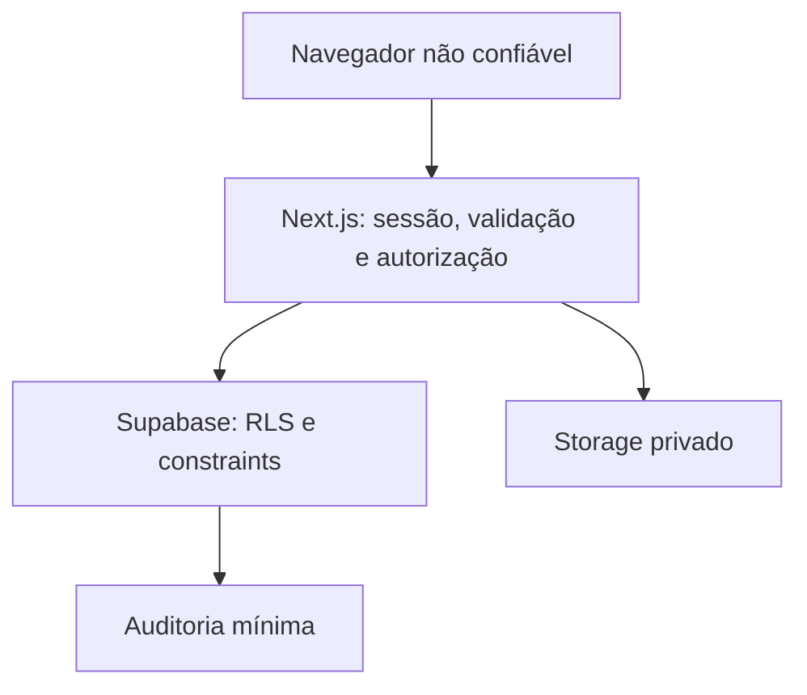

# H&NTrip — Fase 0: descoberta e fundação

Status: arquitetura aprovada; incremento de fundação em implementação  
Data: 2026-07-15

## Inventário inicial

- O workspace original não continha repositório nem código da aplicação.
- Foi criado um checkout inicial do H&NTrip, ainda sem funcionalidades de negócio.
- O starter disponível usa React 19, TypeScript estrito e Tailwind, mas fixa Next.js 16; o prompt mestre fixa Next.js 15. A divergência precisa de decisão antes da implementação.
- Supabase, CI, variáveis de ambiente, migrations e testes do domínio ainda não existem.
- Não há credenciais, dados reais ou segredos no projeto.

## Lacunas e riscos

| Prioridade | Lacuna ou risco | Tratamento proposto |
| --- | --- | --- |
| Bloqueante | Next.js 15 no requisito versus Next.js 16 no starter | Escolher explicitamente a versão antes do primeiro fluxo |
| Alta | Estratégia de convite indefinida | Link administrativo de uso único, curto e armazenado como hash |
| Alta | Ambientes Supabase inexistentes | CLI local, staging separado e produção somente no hardening |
| Alta | Possível vazamento de arquivos entre workspaces | Buckets privados e políticas por `workspace_id/trip_id` |
| Alta | Offline amplo demais para o primeiro MVP | Adiar para a Fase 3; usar idempotência e estados explícitos |
| Média | Realtime pode duplicar estado | Assinar somente a viagem ativa e invalidar chaves específicas |
| Média | Reordenação concorrente | Chave ordenável esparsa e versão do registro |
| Média | Retenção da auditoria indefinida | Metadados mínimos; política definida antes de produção |

## Escopo do MVP

O MVP cobre acesso privado, isolamento por workspace, viagens, participantes informativos, dashboard, roteiro, orçamento/gastos e checklist. Documentos, PWA offline, mapas, fotos, álbum e estatísticas permanecem nas fases posteriores.

## Modelo de entidades



Regras estruturais:

- Toda entidade de negócio carrega `workspace_id`; tabelas filhas também preservam `trip_id` quando isso facilita validar pertencimento.
- PKs são UUID. Datas civis usam `date`; instantes usam `timestamptz` em UTC.
- Dinheiro usa `numeric(14,2)` e moeda ISO 4217 obrigatória na viagem e no gasto.
- `trips` valida `end_date >= start_date` e orçamento não negativo.
- Atividades guardam data, horários locais opcionais e timezone IANA.
- `workspace_members` é a fonte de autorização. Participantes não concedem acesso.
- Listagens usam ordenação determinística com desempate por UUID.

## Limites de confiança e threat model



| Ameaça | Controle | Teste mínimo |
| --- | --- | --- |
| IDOR/acesso cruzado | Sessão + associação ativa + RLS | membro A não acessa workspace B |
| Escalada via payload | Ignorar IDs e papel enviados pelo cliente | payload adulterado é negado |
| Convite roubado/reutilizado | Hash, expiração, uso único e auditoria | token expirado/usado falha |
| SQL/XSS | Queries parametrizadas, Zod, texto sem HTML arbitrário e CSP | entrada maliciosa permanece texto |
| Abuso de login/convite | Rate limit e resposta não enumerável | repetição é limitada sem revelar conta |
| Vazamento em logs | Redação de tokens, URLs e PII | logs de teste não contêm segredo |
| Corrida/duplicidade | Idempotency key e controle de versão | repetição não duplica |
| Upload malicioso | Bucket privado, assinatura/MIME/tamanho e quota | extensão falsa é recusada |

O frontend nunca é autoridade. Server Actions/Route Handlers são a primeira barreira; RLS e constraints são a barreira final. `service_role` nunca entra no runtime público.

## Critérios de aceite — Fase 1

1. Não existe cadastro público.
2. Convite válido ativa o acesso; token inválido, expirado ou usado é rejeitado sem enumeração.
3. Sessão expirada redireciona com destino interno seguro; logout revoga o acesso.
4. Somente membro ativo (`owner` ou `admin`) acessa o workspace.
5. RLS está ativa em todas as tabelas expostas e nega por padrão.
6. Testes cobrem membro autorizado, outro workspace, autenticado sem associação e anônimo.
7. Eventos administrativos relevantes geram auditoria mínima.
8. Loading, vazio, erro e acesso negado funcionam em mobile/desktop e são acessíveis.
9. Lint, typecheck, testes e build passam sem segredos no bundle ou logs.

## Critérios de aceite — Fase 2

1. Administrador cria, edita, arquiva e consulta viagens do próprio workspace.
2. Datas, timezone, moeda, orçamento e status são validados no servidor e banco.
3. Participantes são informativos e não recebem acesso.
4. Dashboard mostra próxima viagem, contagem, orçamento, gasto, saldo e pendências.
5. Roteiro reordena itens de modo determinístico e resiliente a concorrência.
6. Gastos usam decimal, categoria válida e idempotência; totais são testados.
7. Checklist conclui/reabre itens registrando ator e instante.
8. Realtime limita-se à viagem ativa, gasto e checklist.
9. Fluxos tratam loading, vazio, sucesso e erro com responsividade e acessibilidade.
10. Testes de domínio, integração/RLS e E2E essenciais passam.

## Estrutura inicial proposta

```text
app/
  (auth)/
  (app)/
    dashboard/
    trips/
  api/
src/
  features/{access,trips,itinerary,finance,checklist}/
  components/{ui,shared}/
  lib/{auth,supabase,security,validation}/
  types/
supabase/
  migrations/
  tests/
  seed.sql
tests/{unit,integration,e2e}/
docs/{adr,runbooks}/
```

Rotas e layouts ficam em `app`; regras e casos de uso em `src/features`; integrações e limites de confiança em `src/lib`.

## Primeiros incrementos verticais

1. **Fundação verificável:** versão decidida, lint/typecheck/test/build, `.env.example`, headers de segurança, CI e health check.
2. **Banco e isolamento:** concluído no código; execução dos testes pgTAP aguarda um ambiente com Docker/Supabase local.
3. **Acesso privado:** login, logout, sessão, convite administrativo e auditoria.
4. **Viagem mínima:** criar e listar viagem com validação e isolamento.
5. **Dashboard inicial:** próxima viagem e estados vazio/erro.
6. **Planejamento:** participantes, roteiro, gastos e checklist em incrementos separados.

## Decisões

### D1 — Versão do Next.js (aceita)

Next.js 16 foi aprovado em 2026-07-15. A justificativa e as consequências estão registradas em `docs/adr/001-nextjs-16.md`.

### D2 — Entrega do convite

Recomendação: administrador gera link de uso único e o envia manualmente no primeiro incremento. Um provedor de e-mail entra depois, evitando custo e credenciais prematuros.

### D3 — Ambientes Supabase

Recomendação: Supabase CLI local + staging agora; produção antes da Fase 6. Isso reduz custo e risco durante o MVP.

## Decisões arquiteturais iniciais

- ADR-001: módulos por domínio; sem repository genérico antecipado.
- ADR-002: autorização em duas camadas — aplicação e RLS — com negação por padrão.
- ADR-003: Server Components por padrão; TanStack Query somente onde colaboração justificar.
- ADR-004: idempotência nas mutações que futuramente poderão ser repetidas offline.
- ADR-005: documentos/fotos privados e URLs assinadas curtas geradas pelo servidor.
